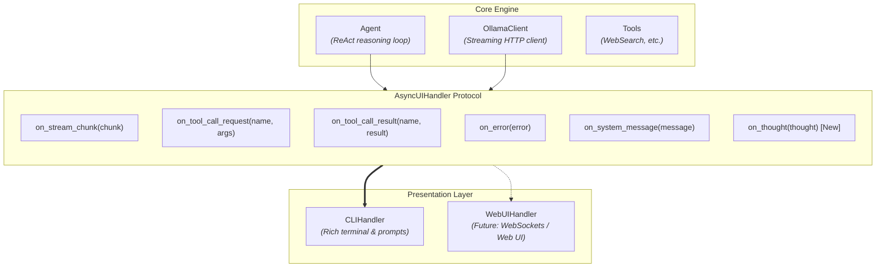
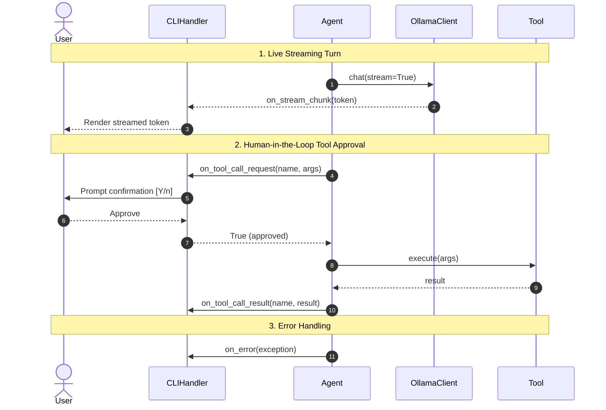

# Event System & UI Handlers

Sensai decouples core agentic logic from UI presentation using an **asynchronous event-driven architecture**. This ensures the backend engine ([`Agent`](reference/sensai/agent.md), [`OllamaClient`](reference/sensai/client.md)) remains presentation-agnostic, supporting terminal interfaces ([`CLIHandler`](reference/sensai/ui/cli.md)) as well as future web or WebSocket clients ([X1] Web UI).

---

## Architecture Overview

All interactions between the agent pipeline and the user flow through the [`AsyncUIHandler`](reference/sensai/ui/protocol.md) protocol.

### Event-Driven Architecture

The core engine is decoupled from the user interface:



### Turn Lifecycle & Event Flow

The sequence below illustrates how events are dispatched during a typical conversational turn:



### Why Asynchronous?

- **Non-blocking streaming**: Incoming tokens from LLM HTTP streams are forwarded in real time without blocking the event loop.
- **Concurrent user interaction**: The UI can prompt for approval or accept user interrupts without freezing background tasks.
- **Universal compatibility**: The same protocol works seamlessly in asynchronous web frameworks (e.g. FastAPI, Starlette, WebSockets).

---

## Existing Events

The [`AsyncUIHandler`](reference/sensai/ui/protocol.md) protocol defines the following standard hooks:

| Event Method | Triggered When | Parameters | Returns |
| :--- | :--- | :--- | :--- |
| `on_stream_chunk` | A new text token is received from the LLM stream. | `chunk: str` | `None` |
| `on_tool_call_request` | A tool is about to be executed and requires user confirmation (`human_in_the_loop=True`). | `name: str`, `arguments: dict[str, Any]` | `bool` (`True` to approve) |
| `on_tool_call_result` | A tool has completed execution. | `name: str`, `result: Any` | `None` |
| `on_error` | An exception occurred during model inference or tool dispatch. | `error: Exception` | `None` |
| `on_system_message` | A generic notification needs to be presented (command responses, notices). | `message: Any` | `None` |

---

## Step-by-Step Guide: Adding a New Event

This guide demonstrates how to add a new event to the system, taking **agent reflection / thinking** (`on_thought`) as an example.

### Step 1: Update the Protocol (`src/sensai/ui/protocol.py`)

Add the new asynchronous method signature to the `AsyncUIHandler` protocol:

```python
class AsyncUIHandler(Protocol):
    """Protocol defining the interface for UI event handlers."""

    # ... existing events ...

    async def on_thought(self, thought: str) -> None:
        """Called when the agent generates an internal reasoning or reflection step.

        Args:
            thought: The reasoning or reflection text produced by the model.
        """
        ...  # pragma: no cover
```

---

### Step 2: Implement the Event in the CLI (`src/sensai/ui/cli.py`)

In `CLIHandler`, implement how this event should be rendered in the terminal. You can leverage [Rich](https://rich.readthedocs.io/) for formatted panels, dimmed text, or collapsible sections:

```python
from rich.panel import Panel


class CLIHandler(AsyncUIHandler):
    # ... existing methods ...

    async def on_thought(self, thought: str) -> None:
        """Render the agent's internal reflection in the terminal."""
        panel = Panel(
            f"[dim italic]{thought}[/dim italic]",
            title="[bold yellow]Thinking[/bold yellow]",
            border_style="yellow",
        )
        self.console.print(panel)
```

---

### Step 3: Emit the Event from Core Logic (`src/sensai/agent.py`)

In the agent reasoning loop (e.g. within `_step` or `_execute_turn`), detect the reflection content (such as `<think>...</think>` tags or specialized reasoning tokens) and notify the UI handler:

```python
if self.ui_handler:
    await self.ui_handler.on_thought(reflection_text)
```

> **Best Practice**: Always check `if self.ui_handler:` before dispatching, allowing the agent to run headlessly in scripts or automated pipelines.

---

### Step 4: Update Tests and Mocks

Ensure that test doubles (such as `MockUIHandler` in test suites) implement the new method to satisfy strict type checkers:

```python
class MockUIHandler:
    async def on_thought(self, thought: str) -> None:
        pass
```
